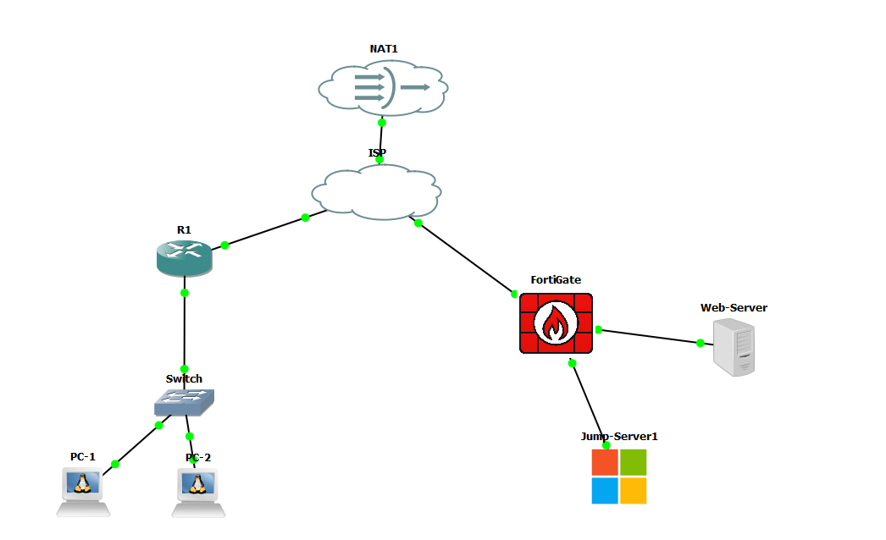

# Infraestructura 2 — Práctica 3

**Estudiante:** Jose Miguel Diaz  
**Matrícula:** 2025-0693  
**Video de demostración:** https://youtu.be/E8OWH8RFvjw

> Laboratorio académico de redes y seguridad. El repositorio está sanitizado: no contiene contraseñas, PSK reales ni claves privadas.

## Propósito

Implementar una infraestructura segmentada con un router Cisco para usuarios, ISP simulado, FortiGate, Web Server y Jump Server. El acceso remoto por VPN termina únicamente en el Jump Server; desde éste se publican recursos RemoteApp con permisos diferenciados y acceso controlado al Web Server.

## Arquitectura

- **Usuarios:** VLAN 10, `10.6.93.0/25`, DHCP desde R1.
- **R1 ↔ ISP:** `200.6.93.0/30`.
- **ISP ↔ FortiGate:** `200.6.93.4/30`.
- **Web Server:** `10.6.94.2/29`, gateway FortiGate `10.6.94.1`.
- **Jump Server:** `10.6.94.10/29`, gateway FortiGate `10.6.94.9`.
- **VPN:** pool `10.6.94.17–10.6.94.22`, destino permitido Jump Server.

## Servicios implementados

El Web Server Ubuntu aloja un **Sistema de Caja por HTTPS**, además de SSH y XRDP para las pruebas autorizadas desde Jump Server. El Jump Server Windows Server 2022 aloja AD DS/DNS y RDS, con RDWeb clásico y RD Web Client HTML5.

### Roles de usuarios

| Rol | RemoteApps visibles |
|---|---|
| No privilegiado (`RemoteApp-NoPriv`) | Web |
| Privilegiado (`RemoteApp-Priv`) | Web, PuTTY, RDP |

## Seguridad

FortiGate permite de Jump a Web únicamente **HTTPS, SSH y RDP**. La VPN tiene como destino el **Jump Server** y no existe una política VPN→Web. El switch aplica Port Security, BPDU Guard, PortFast y una VLAN 999 con `shutdown` para puertos no utilizados. Las políticas y VIP temporales usados durante la instalación fueron eliminados antes de la validación final.

## Evidencias destacadas

- `images/evidencias/03-sistema-caja-https-remoteapp.png` — Sistema de Caja abierto desde RemoteApp Web.
- `images/evidencias/06-html5-privilegiado.png` y `07-html5-no-privilegiado.png` — control por roles en RD Web Client HTML5.
- `images/evidencias/08-fortigate-politicas-finales.png` — políticas finales del firewall.
- `images/evidencias/15-vpn-solo-jump.png` — VPN alcanza Jump/3389 pero no Web/443 directo.
- `images/evidencias/09-switch-port-security.png` — Port Security.

## Estructura del repositorio

- `configs/`: configuraciones sanitizadas de ISP, R1, Switch y resumen FortiGate.
- `vpn/`: plantilla StrongSwan sin secretos.
- `scripts/`: comandos de RDS/RemoteApps y RD Web Client HTML5.
- `web/sistema-caja/`: aplicación de demostración y ejemplo Nginx HTTPS.
- `docs/`: direccionamiento, seguridad y pruebas.
- `images/`: topología y evidencias.

## Nota de seguridad

Los algoritmos IKEv1/DES/SHA1 utilizados en el túnel responden a una limitación de compatibilidad del laboratorio con FortiGate 7.0.9 y **no deben considerarse una configuración recomendada para producción**. Para un entorno real se usarían algoritmos modernos e IKEv2.
